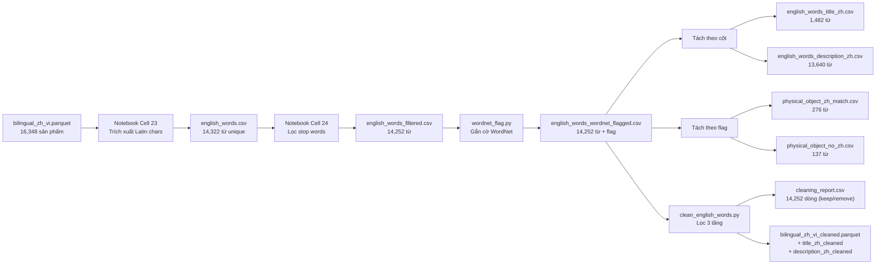
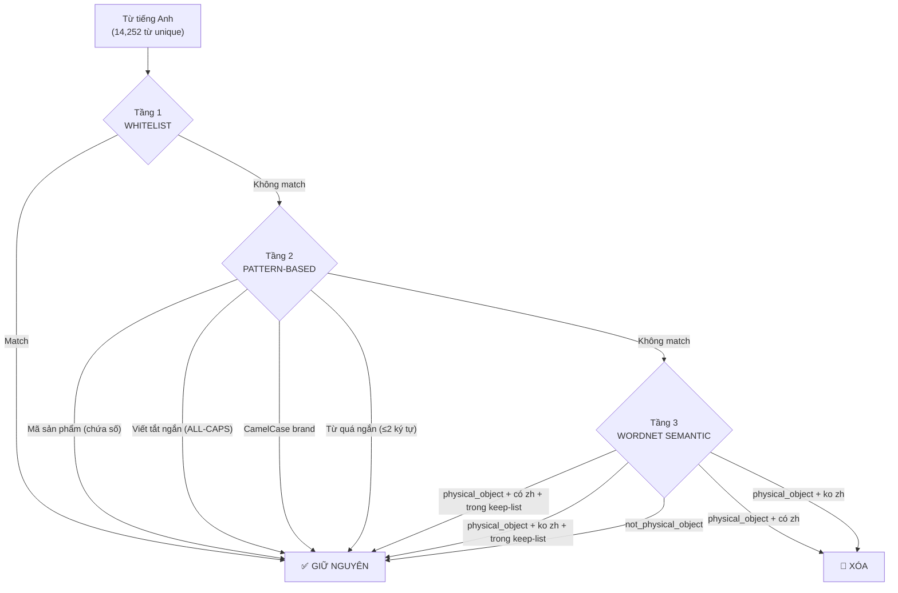

# 📖 Walkthrough — EDA Dữ Liệu Song Ngữ Trung-Việt (E-commerce 1688)

> Tài liệu ghi lại **toàn bộ quá trình khảo sát dữ liệu (EDA)**, các vấn đề phát hiện được, hướng xử lý đã thực hiện và những vấn đề còn tồn đọng trong tập dữ liệu song ngữ Trung-Việt thu thập từ sàn thương mại điện tử 1688.com.

---

## Mục Lục

1. [Tổng Quan Dữ Liệu](#1-tổng-quan-dữ-liệu)
2. [Cấu Trúc Dự Án](#2-cấu-trúc-dự-án)
3. [Quy Trình EDA Đã Thực Hiện](#3-quy-trình-eda-đã-thực-hiện)
4. [Các Vấn Đề Phát Hiện Trong Tập Dữ Liệu](#4-các-vấn-đề-phát-hiện-trong-tập-dữ-liệu)
5. [Trọng Tâm: Từ Tiếng Anh Lẫn Trong Văn Bản Tiếng Trung](#5-trọng-tâm-từ-tiếng-anh-lẫn-trong-văn-bản-tiếng-trung)
6. [Pipeline Xử Lý Từ Tiếng Anh](#6-pipeline-xử-lý-từ-tiếng-anh)
7. [Chiến Lược Lọc 3 Tầng](#7-chiến-lược-lọc-3-tầng)
8. [Kết Quả Sau Xử Lý](#8-kết-quả-sau-xử-lý)
9. [Các Vấn Đề Còn Tồn Đọng](#9-các-vấn-đề-còn-tồn-đọng)
10. [Hướng Phát Triển Tiếp Theo](#10-hướng-phát-triển-tiếp-theo)

---

## 1. Tổng Quan Dữ Liệu

### 1.1 Nguồn gốc

Dữ liệu được crawl từ sàn TMĐT **1688.com** (Alibaba nội địa Trung Quốc), bao gồm thông tin sản phẩm song ngữ Trung-Việt. Đây là tập dữ liệu phục vụ cho bài toán **dịch máy / căn chỉnh song ngữ** trong lĩnh vực thương mại điện tử.

### 1.2 Quy mô

| Chỉ số | Giá trị |
| :--- | :--- |
| Tổng sản phẩm | **16,348** |
| Số cột (fields) | **30** |
| File gốc | [`bilingual_zh_vi.parquet`](bilingual_zh_vi.parquet) (~24.4 MB) |

### 1.3 Cấu trúc cột (Schema)

| Cột | Kiểu | Null | Mô tả |
| :--- | :---: | ---: | :--- |
| `product_id` | str | 0 | Mã sản phẩm trên 1688 |
| `title_zh` | str | 0 | Tiêu đề tiếng Trung |
| `title_vi` | str | 0 | Tiêu đề tiếng Việt (đã dịch) |
| `description_zh` | str | 0 | Mô tả sản phẩm tiếng Trung |
| `description_vi` | str | 0 | Mô tả sản phẩm tiếng Việt |
| `category` | str | 0 | Danh mục sản phẩm |
| `price` | float | 0 | Giá sản phẩm (CNY) |
| `sales` | float | 543 | Doanh số bán |
| `province` / `city` | str | 2 / 16 | Vị trí nhà cung cấp |
| `biz_type` | str | 2,697 | Loại hình kinh doanh |
| `shop` | str | 0 | Tên cửa hàng |
| `attributes_zh` / `attributes_vi` | object | 0 | Thuộc tính sản phẩm (nested) |
| `n_attributes_zh` / `_vi` / `_aligned` | int | 0 | Số lượng thuộc tính |
| `description_extra_zh` | str | 0 | Mô tả bổ sung |
| `description_images` | int | 0 | Số ảnh trong mô tả |
| ... | ... | ... | Các cột meta khác (crawl_time, worker, keyword, page, url, search_url, is_ad, category_1688, ...) |

---

## 2. Cấu Trúc Dự Án

```
ecom-eda/
├── bilingual_zh_vi.parquet              # Dữ liệu gốc
├── bilingual_zh_vi_cleaned.parquet      # Dữ liệu đã xử lý (thêm cột *_cleaned)
├── bilingual_zh_vi_cleaned(huy).parquet # Bản cleaned riêng (Huy)
│
├── csv/                                 # Tất cả file CSV từ EDA
│   ├── eda_summary.csv                  # Bảng tổng hợp chỉ số EDA
│   ├── eda_suspect_pairs.csv            # 29 cặp câu nghi lệch căn chỉnh
│   ├── english_words.csv                # 14,322 từ tiếng Anh trích xuất + product_id
│   ├── english_words_filtered.csv       # 14,252 từ sau khi bỏ stop words / đơn vị
│   ├── english_words_wordnet_flagged.csv# 14,252 từ đã gắn cờ WordNet
│   ├── english_words_title_zh.csv       # 1,482 từ xuất hiện trong title_zh
│   ├── english_words_description_zh.csv # 13,640 từ xuất hiện trong description_zh
│   ├── physical_object_zh_match.csv     # 276 từ physical object có bản dịch TQ
│   ├── physical_object_no_zh.csv        # 137 từ physical object chưa có bản dịch TQ
│   └── cleaning_report.csv              # 14,252 dòng báo cáo phân loại keep/remove
│
├── data/cleaned/                        # Thư mục dữ liệu đã xử lý
│
├── eda-bilingual_zh_vi.ipynb            # Notebook EDA chính (25 cells)
├── query_parquet.py                     # Tool truy vấn parquet bằng SQL/DuckDB
├── wordnet_flag.py                      # Script gắn cờ WordNet cho từ tiếng Anh
├── clean_english_words.py               # Script xử lý (xóa) từ tiếng Anh thừa
├── upload_to_hf.py                      # Script upload lên Hugging Face Hub
├── requirements.txt                     # Dependencies
└── Walkthrough.md                       # ← File này
```

---

## 3. Quy Trình EDA Đã Thực Hiện

Toàn bộ quá trình EDA được ghi lại trong notebook [`eda-bilingual_zh_vi.ipynb`](eda-bilingual_zh_vi.ipynb) với các bước:

### Bước 1 — Tổng quan dữ liệu
- Load parquet, kiểm tra shape (16,348 × 30), dtypes, null values.
- Phát hiện: `sales` có 543 null, `biz_type` có 2,697 null (16.5%).

### Bước 2 — Loại dòng trùng `title_zh == title_vi`
- Phát hiện các dòng nghi chưa dịch (title tiếng Trung == title tiếng Việt).
- **Chỉ loại dòng trùng title, giữ lại từ tiếng Anh để tiếp tục EDA.**

### Bước 3 — Thống kê văn bản
- Độ dài ký tự trung bình: `title_zh` ~31 ký tự, `title_vi` ~125 ký tự.
- Token trung bình: `title_zh` ~31 token, `title_vi` ~28 token.
- Tỷ lệ token trung vị (zh/vi): **0.90** — tương đối cân bằng.
- Tỷ lệ ngoại lai (outlier): **0.18%** — rất thấp.

### Bước 4 — Từ vựng & thuật ngữ TMĐT
- Top 30 token phổ biến mỗi ngôn ngữ.
- Phân tích token overlap giữa ZH và VI.

### Bước 5 — Kiểm tra trùng lặp
- Trùng lặp cặp (title_zh, title_vi): **1.29%**
- Trùng riêng title_zh: **2.97%**
- Trùng riêng title_vi: **1.33%**

### Bước 6 — Similarity bằng BAAI/bge-m3
- Embedding đa ngôn ngữ 1024 chiều.
- Tính cosine similarity cho toàn bộ cặp title_zh ↔ title_vi.
- Kết quả: phần lớn cặp câu đạt similarity **0.7–0.9**, xác nhận chất lượng dịch tốt.

### Bước 7 — Heuristic token-ratio
- Phát hiện các cặp câu lệch căn chỉnh bất thường (token ratio outlier).
- **29 cặp nghi vấn** được trích xuất → [`csv/eda_suspect_pairs.csv`](csv/eda_suspect_pairs.csv)

### Bước 8 — Trích xuất & lọc từ tiếng Anh
- Trích toàn bộ chuỗi Latin nằm trong văn bản Hán tự.
- Pipeline: `english_words.csv` → lọc stop words → `english_words_filtered.csv`
- Gắn cờ WordNet → `english_words_wordnet_flagged.csv`

---

## 4. Các Vấn Đề Phát Hiện Trong Tập Dữ Liệu

### Bảng tổng hợp chỉ số EDA

| Chỉ số | Giá trị | Đánh giá |
| :--- | :--- | :--- |
| Null max (%) | 16.50% | ⚠️ `biz_type` có null nhiều |
| Empty max (%) | 77.07% | ⚠️ Một số cột rỗng đáng kể |
| Trùng cặp (%) | 1.29% | ✅ Thấp |
| Trùng title_zh (%) | 2.97% | ⚠️ Có trùng |
| Trùng title_vi (%) | 1.33% | ✅ Thấp |
| Token ratio median | 0.90 | ✅ Cân bằng tốt |
| Ratio outliers (%) | 0.18% | ✅ Rất thấp |
| Suspect pairs (%) | 0.18% | ✅ Rất ít cặp nghi vấn |

### 4.1 Giá trị null / rỗng

- **`biz_type`**: 2,697 giá trị null (16.5%) — cột loại hình kinh doanh không được điền đầy đủ.
- **`sales`**: 543 null (3.3%) — một số sản phẩm chưa có dữ liệu doanh số.
- **`province`** / **`city`**: vài giá trị null — ảnh hưởng không đáng kể.

### 4.2 Trùng lặp

- ~2.97% sản phẩm có `title_zh` giống nhau → có thể là sản phẩm đăng lại / từ nhiều shop.
- ~1.29% trùng cả cặp (title_zh, title_vi).

### 4.3 Cặp câu lệch căn chỉnh (Suspect Pairs)

- **29 cặp** có token ratio bất thường (ratio ≤ 0.20) → nghi ngờ bản dịch tiếng Việt bị cắt ngắn hoặc lệch ngữ nghĩa.
- Ví dụ: `车载垃圾袋粘贴自立式收纳袋汽车内用桶必用品车上好物备实用大全` có ratio chỉ 0.20.

### 4.4 **Từ tiếng Anh lẫn trong văn bản tiếng Trung** ← VẤN ĐỀ CHÍNH

> [!IMPORTANT]
> Đây là vấn đề nghiêm trọng nhất được phát hiện và là trọng tâm EDA. Từ tiếng Anh xuất hiện lẫn trong cả `title_zh` và `description_zh` với tần suất rất cao, gây nhiễu cho quá trình dịch máy và căn chỉnh song ngữ.

| Phạm vi | Mức ảnh hưởng |
| :--- | :--- |
| Sản phẩm có English trong `title_zh` | **3,838 / 16,348 (23.5%)** |
| Sản phẩm có English trong `description_zh` | **15,325 / 16,348 (93.7%)** |

---

## 5. Trọng Tâm: Từ Tiếng Anh Lẫn Trong Văn Bản Tiếng Trung

### 5.1 Phát hiện ban đầu

Qua EDA, phát hiện **14,322 từ tiếng Anh unique** nằm xen lẫn trong văn bản tiếng Trung. Sau khi lọc bỏ stop words và từ quá phổ biến, còn **14,252 từ**.

### 5.2 Phân bổ theo vị trí xuất hiện

| Vị trí | Số từ unique | Tỉ lệ |
| :--- | ---: | :--- |
| Chỉ `description_zh` | 12,770 | 89.6% |
| Cả `description_zh` + `title_zh` | 870 | 6.1% |
| Chỉ `title_zh` | 612 | 4.3% |

→ **Hầu hết từ tiếng Anh nằm trong description** (thông số kỹ thuật), nhưng **title** mới là trọng tâm xử lý vì ảnh hưởng trực tiếp đến chất lượng dịch.

### 5.3 Phân loại ngữ nghĩa bằng WordNet

Script [`wordnet_flag.py`](wordnet_flag.py) sử dụng **Princeton WordNet** + **Open Multilingual WordNet (OMW)** để phân loại:

| Nhãn (Flag) | Ý nghĩa | Số từ unique | Tỉ lệ |
| :--- | :--- | ---: | :--- |
| `not_physical_object` | Không phải danh từ vật thể → khả năng cao là viết tắt, mã, brand | 13,839 | 97.1% |
| `physical_object_zh_match` | Là danh từ vật thể VÀ có bản dịch tiếng Trung trong WordNet | 276 | 1.9% |
| `physical_object_no_zh` | Là danh từ vật thể NHƯNG chưa có bản dịch TQ | 137 | 1.0% |

### 5.4 Phân tích pattern hình thức (title_zh)

Trong **1,482 từ** xuất hiện ở `title_zh`:

| Pattern | Số lượng | Ví dụ | Nhận định |
| :--- | ---: | :--- | :--- |
| Mã sản phẩm (chứa số) | ~80.9% | `iPhone14`, `x200cm`, `M416` | ✅ Giữ |
| Viết tắt ALL-CAPS (2–5 chữ) | ~6.9% | `USB`, `PU`, `ABS`, `PVC` | ✅ Giữ |
| Từ lowercase thực sự | ~3.8% | `oversize`, `cleanfit`, `vintage` | 🟡 Xem xét |
| Hỗn hợp | ~8.4% | `MagSafe`, `BAPE`, `backpack` | ⚠️ Cần phân loại kỹ |

### 5.5 Ba nhóm ngữ nghĩa chính

#### 🟢 Nhóm 1: NÊN GIỮ — Thương hiệu / Model / Viết tắt kỹ thuật
Không có tương đương tiếng Trung, là một phần danh tính sản phẩm:
```
适用华为vivo苹果OPPO蓝牙2025耳机
华强北八代蓝牙耳机适用iPhone降噪
1080P高清安卓导航行车记录器USB连接ADAS驾驶
```
**Ví dụ:** `iPhone`, `OPPO`, `vivo`, `USB`, `LED`, `GPS`, `WIFI`, `ADAS`, `DVR`, `PU`, `PVC`, `ABS`, `EVA`

#### 🟡 Nhóm 2: GIỮ (từ vay mượn) — Từ phong cách / xu hướng
Đã trở thành "từ mượn" phổ biến trong ngôn ngữ TMĐT Trung Quốc:
```
棕色麂皮绒重磅圆领短袖T恤男夏季美式复古潮牌潮流oversize潮衫
浅灰色卷边条纹长袖t恤男款秋季高级感慵懒风卫衣cleanfit打底衫
2025新款复古vintage饭盒包FF老花枕头包
```
**Ví dụ:** `oversize` (27 lần), `cleanfit` (10), `vintage`, `ulzzang`, `chic`, `boxy`

#### 🔴 Nhóm 3: CẦN XÓA — Từ tiếng Anh dư thừa / nhồi SEO
Từ tiếng Anh mô tả sản phẩm, đã có bản dịch tiếng Trung tương đương trong câu:
```
马可莱登商务双肩包男爆款跨境多功能男士背包防水旅行电脑包bags
BANGE双肩包超薄背包男可扩容大容量商务多功能电脑防水backpack
女式包包工厂尾货批发包包网红同款女包Nvbao weihuo wholesale
```
**Ví dụ:** `bags` (92 lần), `clothes` (72), `bag` (45), `shoes` (21), `backpack` (16), `wholesale` (5)

---

## 6. Pipeline Xử Lý Từ Tiếng Anh

Quá trình xử lý được thiết kế thành một pipeline gồm nhiều bước, mỗi bước tạo ra một file CSV trung gian để có thể review và debug:



### Các file CSV trung gian và vai trò

| # | File | Dòng | Vai trò |
| :---: | :--- | ---: | :--- |
| 1 | [`english_words.csv`](csv/english_words.csv) | 14,322 | Trích xuất thô: mỗi từ tiếng Anh + count + columns + product_ids |
| 2 | [`english_words_filtered.csv`](csv/english_words_filtered.csv) | 14,252 | Lọc bỏ stop words, đơn vị đo đơn lẻ |
| 3 | [`english_words_wordnet_flagged.csv`](csv/english_words_wordnet_flagged.csv) | 14,252 | Thêm cột `flag` (physical_object_zh_match / no_zh / not_physical_object) + `zh_translations` + `synsets` |
| 4 | [`english_words_title_zh.csv`](csv/english_words_title_zh.csv) | 1,482 | Subset chỉ chứa từ có `columns` = title_zh |
| 5 | [`english_words_description_zh.csv`](csv/english_words_description_zh.csv) | 13,640 | Subset chỉ chứa từ có `columns` = description_zh |
| 6 | [`physical_object_zh_match.csv`](csv/physical_object_zh_match.csv) | 276 | Từ vật thể CÓ bản dịch TQ → ứng viên xóa |
| 7 | [`physical_object_no_zh.csv`](csv/physical_object_no_zh.csv) | 137 | Từ vật thể CHƯA có bản dịch TQ → cần review thủ công |
| 8 | [`cleaning_report.csv`](csv/cleaning_report.csv) | 14,252 | Báo cáo cuối: mỗi từ được gán action (keep/remove) + reason |

---

## 7. Chiến Lược Lọc 3 Tầng

Script [`clean_english_words.py`](clean_english_words.py) triển khai chiến lược **Rule-based Multi-layer Filtering**:



### Tầng 1: Whitelist (Hardcoded)

Danh sách ~200 từ **chắc chắn giữ**, chia thành 4 nhóm:

| Nhóm | Số từ | Ví dụ |
| :--- | ---: | :--- |
| **BRANDS** (Thương hiệu / Model) | ~50 | `iPhone`, `OPPO`, `vivo`, `Samsung`, `BAPE`, `Nike`, `MagSafe`, `Pro`, `Max` |
| **TECH_ABBREVIATIONS** (Viết tắt kỹ thuật) | ~100 | `USB`, `LED`, `GPS`, `WIFI`, `PVC`, `ABS`, `EVA`, `TPU`, `SSD`, `RAM` |
| **UNITS_AND_SIZES** (Đơn vị / Kích thước) | ~30 | `cm`, `kg`, `mAh`, `XL`, `XXL`, `GB` |
| **LOANWORDS** (Từ vay mượn) | ~25 | `oversize`, `cleanfit`, `vintage`, `ulzzang`, `chic`, `retro` |

### Tầng 2: Pattern-based (Regex)

Tự động nhận diện mẫu hình thức mà không cần whitelist:

```python
# Mã sản phẩm: chứa ít nhất 1 chữ số → giữ
re.search(r'\d', word)              # iPhone14, x200cm, M416, B5

# Viết tắt ALL-CAPS (1–5 ký tự) → giữ
re.match(r'^[A-Z]{1,5}$', word)     # USB, PU, ABS

# CamelCase → brand name → giữ
re.match(r'^[A-Z][a-z]+[A-Z]', word)  # MagSafe, ProMax

# Từ quá ngắn (≤2 ký tự) → không mang nghĩa → giữ
len(word) <= 2
```

### Tầng 3: WordNet Semantic

Dùng kết quả từ [`wordnet_flag.py`](wordnet_flag.py), nhưng có 2 danh sách **ngoại lệ** để bảo vệ các từ bị WordNet hiểu nhầm:

- **`PHYSICAL_MATCH_KEEP`** (~40 từ): Các từ bị WordNet gắn cờ `physical_object_zh_match` nhưng trong ngữ cảnh e-commerce thực ra là brand / tech / style:
  - `AI` (trí tuệ nhân tạo, không phải "vật thể AI"), `PET` (nhựa PET), `Air` (iPad Air), `mini` (iPad mini)
  - `bear`, `fox`, `Peach` (thường là tên brand), `camera` (đi kèm dashcam)

- **`PHYSICAL_NO_ZH_KEEP`** (~40 từ): Các từ bị WordNet gắn cờ `physical_object_no_zh` nhưng nên giữ:
  - `Pro`, `WIFI`, `Galaxy` (Samsung), `samba` (Adidas Samba), `Lolita` (phong cách váy), `gentlewoman` (thương hiệu túi xách)

### Kết quả phân loại

| Action | Reason | Số từ |
| :--- | :--- | ---: |
| **keep** | `pattern:model_code` (chứa số) | 11,201 |
| **keep** | `not_physical_object` | 1,388 |
| **keep** | `pattern:short_abbreviation` | 1,089 |
| **keep** | `whitelist` | 129 |
| **keep** | `pattern:camelcase_brand` | 66 |
| **keep** | `pattern:too_short` | 59 |
| **keep** | `phys_match_but_keep` (ngoại lệ) | 33 |
| **keep** | `phys_no_zh_but_keep` (ngoại lệ) | 30 |
| **remove** | `physical_object_zh_match` | 187 |
| **remove** | `physical_object_no_zh` | 68 |
| | **Tổng keep** | **13,997 (98.2%)** |
| | **Tổng remove** | **255 (1.8%)** |

---

## 8. Kết Quả Sau Xử Lý

### 8.1 File output

- [`bilingual_zh_vi_cleaned.parquet`](bilingual_zh_vi_cleaned.parquet): 16,348 dòng, thêm 2 cột `title_zh_cleaned` và `description_zh_cleaned`.
- [`csv/cleaning_report.csv`](csv/cleaning_report.csv): Báo cáo chi tiết cho 14,252 từ.

### 8.2 Top từ bị xóa trong `title_zh`

| Từ | Lượt xuất hiện | Lý do xóa |
| :--- | ---: | :--- |
| `bags` | 92 | physical_object_zh_match — đã có từ "包" (bao/túi) |
| `clothes` | 72 | physical_object_zh_match — đã có từ "衣" (áo/quần áo) |
| `bag` | 45 | physical_object_zh_match |
| `shoes` | 21 | physical_object_zh_match — đã có từ "鞋" (giày) |
| `hips` | 19 | physical_object_zh_match |
| `mask` | 18 | physical_object_zh_match — đã có từ "面膜"/"口罩" |
| `backpack` | 16 | physical_object_zh_match — đã có từ "双肩包"/"背包" |
| `PLOVER` | 14 | physical_object_zh_match |
| `cam` | 13 | physical_object_zh_match |
| `luggage` | 10 | physical_object_zh_match — đã có từ "行李箱" |

---

## 9. Các Vấn Đề Còn Tồn Đọng

> [!WARNING]
> Các vấn đề dưới đây chưa được xử lý hoặc chỉ mới xử lý một phần. Cần tiếp tục giải quyết trước khi dùng dataset cho production.

### 9.1 ⚠️ Từ tiếng Anh trong `description_zh` — Chưa xử lý triệt để

- **93.7%** description chứa từ tiếng Anh, nhưng hầu hết là thông số kỹ thuật hợp lệ (PVC, USB, LED, kích thước...).
- Script `clean_english_words.py` xóa từ ở cả title và description, nhưng chủ yếu tập trung vào title.
- **Vấn đề**: Description rất dài và phức tạp, từ tiếng Anh có thể nằm trong ngữ cảnh HTML/bảng thông số → xóa thô có thể gây hỏng format.
- **Hướng xử lý đã khảo sát**: Chỉ xóa từ `physical_object_zh_match` nếu đứng riêng (không nằm trong chuỗi thông số). Tạm hoãn vì chi phí xử lý cao, lợi ích thấp.

### 9.2 ⚠️ Whitelist hardcoded — Chưa chuyển sang file ngoài

- Hiện tại whitelist (BRANDS, TECH_ABBREVIATIONS, UNITS_AND_SIZES, LOANWORDS) được hardcode trong [`clean_english_words.py`](clean_english_words.py).
- **Vấn đề**: Khó mở rộng, khó review, không theo dõi được lịch sử thay đổi.
- **Hướng đã đề xuất**: Chuyển sang file `whitelist.csv` với schema:
  ```csv
  word,category,domain,match_mode,reason
  iPhone,brand,electronics,exact,Thương hiệu Apple
  PPSU,tech_material,baby_products,ignore_case,Nhựa bình sữa
  ```
- **Trạng thái**: Đã đề xuất kiến trúc nhưng **chưa triển khai**.

### 9.3 ⚠️ Ngoại lệ `PHYSICAL_MATCH_KEEP` và `PHYSICAL_NO_ZH_KEEP` — Chưa review đầy đủ

- Hai danh sách ngoại lệ (~80 từ) được xây dựng qua phân tích thủ công, nhưng:
  - Một số từ có thể sai ngữ cảnh (VD: `camera` — giữ vì "đi kèm dashcam" nhưng nếu đứng riêng thì nên xóa).
  - Chưa có validation tự động: không chạy lại trên dữ liệu mới để kiểm tra false positive/negative.

### 9.4 ⚠️ 29 cặp câu nghi lệch căn chỉnh — Chưa xử lý

- [`csv/eda_suspect_pairs.csv`](csv/eda_suspect_pairs.csv) chứa 29 cặp có token ratio ≤ 0.20.
- **Vấn đề**: Bản dịch tiếng Việt bị cắt ngắn bất thường so với tiếng Trung. Có thể do lỗi crawl hoặc bản dịch thiếu.
- **Hướng xử lý**: Review thủ công hoặc gửi dịch lại.

### 9.5 ⚠️ Trùng lặp title_zh ~2.97%

- Khoảng 486 sản phẩm có `title_zh` giống nhau. Có thể là:
  - Sản phẩm đăng lại từ nhiều shop.
  - Cùng sản phẩm nhưng khác thuộc tính (size, màu).
- **Hướng xử lý**: Dedup theo product_id hoặc giữ nguyên tùy mục đích sử dụng.

### 9.6 ⚠️ Null values ở `biz_type` (16.5%) và `sales` (3.3%)

- `biz_type`: 2,697 null — không rõ loại hình kinh doanh.
- `sales`: 543 null — không có dữ liệu doanh số.
- **Hướng xử lý**: Impute bằng giá trị mặc định hoặc drop tùy mục đích downstream.

### 9.7 ⚠️ Empty values ở một số cột (max 77%)

- Một số cột có giá trị rỗng (empty string) rất cao, có thể ảnh hưởng đến chất lượng nếu dùng làm feature.
- **Hướng xử lý**: Xác định cột nào cần thiết cho task cụ thể rồi quyết định drop hay impute.

### 9.8 ⚠️ Xử lý regex trong `clean_text()` — Có rủi ro

- Hàm `clean_text()` trong [`clean_english_words.py`](clean_english_words.py) xóa từ bằng regex đơn giản, có thể:
  - Xóa nhầm substring (VD: từ "bag" có thể match trong "handbag" nếu không cẩn thận word boundary).
  - Gặp lỗi với từ nằm sát ký tự CJK (không có dấu cách ranh giới).
- **Hướng xử lý**: Cải thiện regex bằng lookahead/lookbehind cho ranh giới CJK-Latin; hoặc dùng tokenizer chuyên biệt.

### 9.9 ⚠️ `bilingual_zh_vi_cleaned.parquet` — Title/Desc changed = 0

- Kết quả chạy cho thấy `Title changed: 0`, `Description changed: 0`. Nguyên nhân có thể do mismatch giữa `product_id` trong `english_words.csv` (dùng để map) và `product_id` trong parquet gốc.
- **Cần debug**: Kiểm tra mapping product_id → words_to_remove có khớp đúng không.

---

## 10. Hướng Phát Triển Tiếp Theo

### Phase 1: Hoàn thiện xử lý `title_zh` (ưu tiên cao)

1. **Debug mapping product_id** → đảm bảo `clean_english_words.py` thực sự xóa được từ.
2. **Chuyển whitelist ra file `whitelist.csv`** để dễ review, mở rộng, version control.
3. **Validation**: So sánh title trước/sau xử lý trên tập mẫu, đánh giá chất lượng dịch.

### Phase 2: Xử lý `description_zh` (ưu tiên trung bình)

1. Chỉ xóa từ `physical_object_zh_match` đứng riêng biệt.
2. Giữ nguyên từ nằm trong chuỗi thông số kỹ thuật / bảng thuộc tính.

### Phase 3: Xử lý các vấn đề khác

1. Review 29 cặp suspect pairs.
2. Xử lý null / empty values.
3. Dedup nếu cần cho task cụ thể.

### Phase 4: Upload & chia sẻ

1. Upload bản cleaned lên **Hugging Face Hub** (script [`upload_to_hf.py`](upload_to_hf.py) đã sẵn sàng).
2. Tạo Dataset Card mô tả chi tiết quá trình xử lý.

---

> [!TIP]
> Tham khảo thêm:
> - Notebook EDA gốc: [`eda-bilingual_zh_vi.ipynb`](eda-bilingual_zh_vi.ipynb)
> - Tool truy vấn nhanh: `python query_parquet.py "SELECT * FROM data WHERE product_id = '...'"`
> - Script upload: `python upload_to_hf.py --file bilingual_zh_vi_cleaned.parquet`
